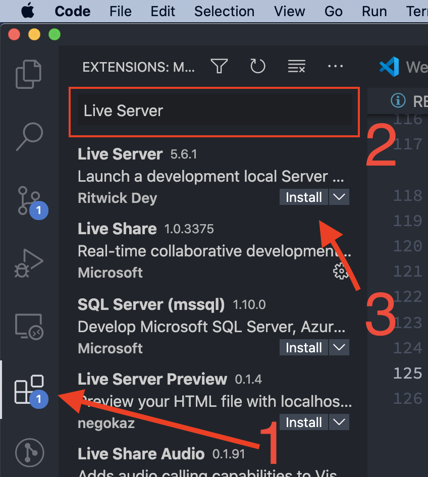
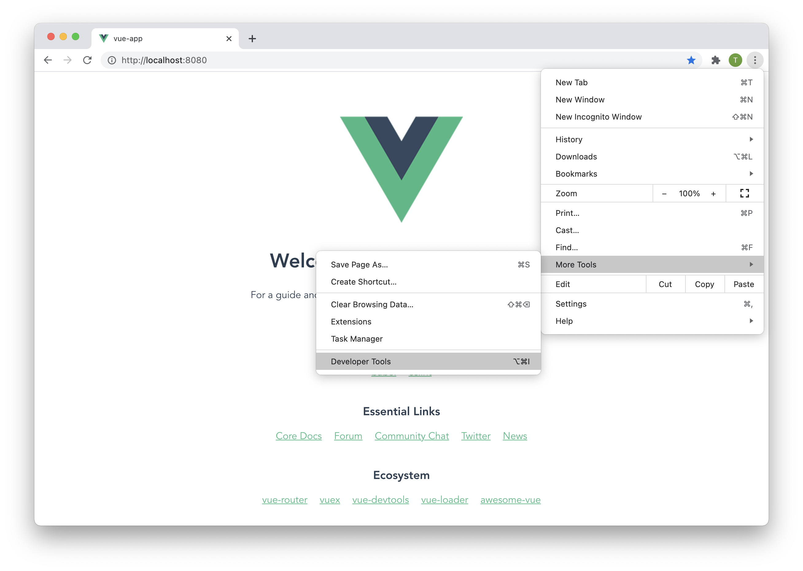
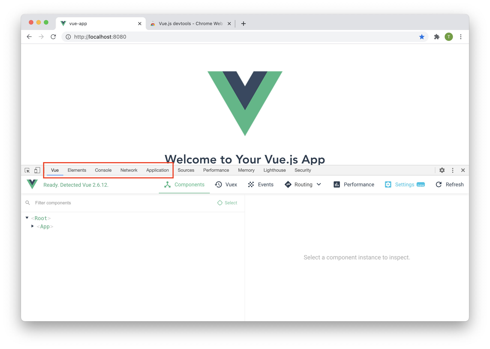
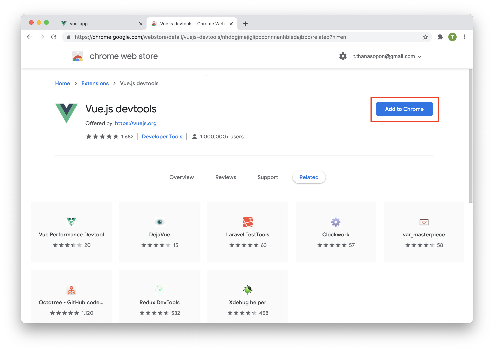

# เตรียมความพร้อมเครื่อง Windows 10 สำหรับวิชา Web Programming

---

## โปรแกรมที่ต้องใช้
* NodeJS
* MySQL database
* MySQL Workbench
* VSCode
* VSCode Live Server
* Postman
* Google Chrome และ Vue.js devtools

---

### 1. ติดตั้ง Nodejs

Nodejs เป็น runtime ภาษา javascript ที่ช่วยให้เราสามารถรันโค๊ด javascript นอกเว็บเบราเซอร์ได้

1. เข้าไปที่เว็บไซต์ https://nodejs.org/en/ ดาวน์โหลดและติดตั้งเวอร์ชันล่าสุด (15.5.1 ขึ้นไป)  
Double Click เพื่อติดตั้งโปรแกรม `node-v15.5.1-x64.msi` และกด next ไปเรื่อยๆ (ใช้ค่า default ทั้งหมด)
<details>
<br>
<br> 
<br>
<br>
<br>
<br>
<br>
<br>
</details>
<br>

2. ตรวจสอบว่าติดตั้งสำเร็จโดย เปิดโปรแกรม `powershell.exe.` และพิมพ์คำสั่ง
```
PS \> node --version
v15.5.1
```
<details>
<br>
<br>
</details>

### 2. ติดตั้ง MySQL Database และ MySQL Workbench
1. Download ตัว installer จาก https://dev.mysql.com/downloads/installer/  
<br>
<br>

2. รันตัวติดตั้งโปรแกรม `mysql-installer-web-community-8.0.22.0.msi`  
<br>

3. เลือก Custom  
<br>

4. รายการที่เราต้องการจะ Install
    - ยกเลิกรายการด้านขวาทั้งหมด  
<br>
    - เลือก **MySQL Server/MySQL Server 8.0/MySQL Server 8.0.22 - x64**  
<br>
    - เลือก **Application/MySQL Workbench/MySQL Workbench 8.0.22 - x64**  
<br>
    - กด Next  
<br>

5. กด Execute รอจนโปรแกรมดาวน์โหลดเสร็จ จากนั้นกด Next  
<br>
<br>

6. กด Execute และรอให้โปรแกรมติดตั้งเสร็จ จากนั้นกด Next และ Finish
<br>
<br>
<br>

7. รันตัวติดตั้งโปรแกรม `mysql-installer-web-community-8.0.22.0.msi` อีกครั้ง  
และคลิก Reconfigure เพื่อทำการตั้งค่า MySQL Server  
<br>
<br>
<br>
<br>
<br>
<br>

8. เปิดโปรแกรม MySQL Workbench เพื่อตรวจสอบว่าติดตั้งสำเร็จแล้ว
<br>


### 3. ติดตั้ง VSCode

VSCode เป็นโปรแกรม text editor ยอดนิยมในการเขียนโค๊ด สามารถดาวโหลดน์มาติดตั้งได้เหมือนโปรแกรมทั่วไป [download](https://code.visualstudio.com/)


### 4. ติดตั้ง Live Server Extension สำหรับ VSCode

Live Server เป็น ส่วนขยาย (Extension) สำหรับ VSCode  
เจ้า Live Server ตัวนี้จะช่วย refresh หน้าเว็บของเราโดยอัตโนมัติเมื่อเราทำการ save ไฟล์

วิธีการติดตั้ง Extension ใน VSCode
1. เปิดโปรแกรม VSCode และเลือกที่เมนู Extension 
2. ค้นหาคำว่า "Live Server"
3. เลือก Live Server ของคุณ "Ritwick Dey" กดปุ่ม Install
<details>
    <summary>ดูรูป</summary>
    
</details>
<br>

4. รอจน Install เสร็จ จากนั้นปิดโปรแกรม VSCode และเปิดขึ้นมาใหม่

### 5. Postman

Postman เป็น REST API Client สามารถช่วยเราในการทดสอบ API ที่เราจะสร้างขึ้นมา  
สามารถดาวโหลดน์มาติดตั้งได้เหมือนโปรแกรมทั่วไป [download](https://www.postman.com/downloads/)

### 6. Google Chrome และ Vue.js devtools
ในวิชานี้แนะนำให้ใช้ Google Chrome เป็นเว็บเบราเซอร์ในการเขียนโปรแกรม เนื่องจาก Google Chrome มีเครื่องมือสำหรับนักพัฒนาที่ใช้ง่าย  

โดยเราสามารถเปิดเครื่องมือนักพัฒนา (Developer Tools) โดยการกดปุ่ม F12 หรือ ทำตามรูป



โดยแทปที่ใช้บ่อย ๆ คือ
* Element
* Console
* Network
* Application
* Vue (ต้อง install extension [Vue.js devtools](https://chrome.google.com/webstore/detail/vuejs-devtools/nhdogjmejiglipccpnnnanhbledajbpd/related?hl=en) จาก Chrome Web Store ก่อน)
    <details>
         
    </details>

**หมายเหตุ** อาจจะยังมองไม่เห็นแทป Vue เนี่องจากแทปนี้จะปรากฎขึ้นมาเมื่อเราเปิดเว็บไซต์ที่มีการใช้ vue.js ใน development mode เท่านั้น  
สามารถตรวจสอบว่า Vuejs devtools สามารถใช้งานได้ [ที่นี่](https://vuejs.org/v2/guide/)


