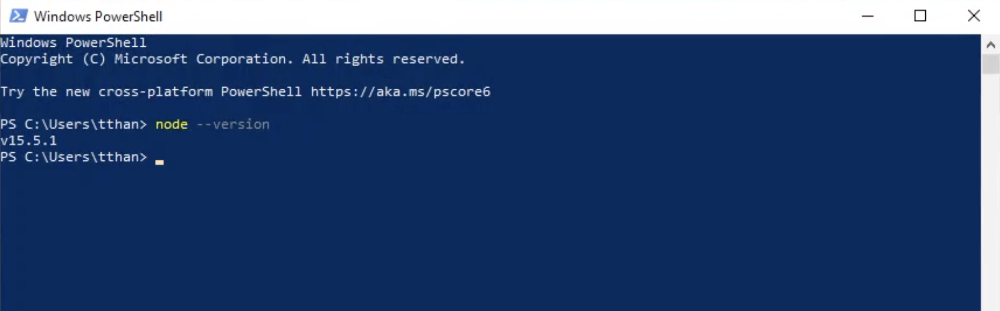

# เตรียมความพร้อมเครื่อง Windows 10 สำหรับวิชา Web Programming

---

## โปรแกรมที่ต้องใช้
* NodeJS
* MySQL database
* VSCode
* VSCode Live Server
* Postman

---

### 1. ติดตั้ง Nodejs

Nodejs เป็น runtime ภาษา javascript ที่ช่วยให้เราสามารถรันโค๊ด javascript นอกเว็บเบราเซอร์ได้

1. เข้าไปที่เว็บไซต์ https://nodejs.org/en/ ดาวน์โหลดและติดตั้งเวอร์ชันล่าสุด (15.5.1 ขึ้นไป)  
Double Click เพื่อติดตั้งโปรแกรม `node-v15.5.1-x64.msi` และกด next ไปเรื่อยๆ (ใช้ค่า default ทั้งหมด)
<details>
<br>
<br> 
<br>
<br>
<br>
<br>
<br>
<br>
</details>
<br>

2. ตรวจสอบว่าติดตั้งสำเร็จโดย เปิดโปรแกรม `powershell.exe.` และพิมพ์คำสั่ง
```
PS \> node --version
v15.5.1
```
<details>
<br>
<br>
</details>

### 2. ติดตั้ง MySQL Database
1. Download ตัว installer จาก https://dev.mysql.com/downloads/installer/  
<br>
<br>

2. รันตัวติดตั้งโปรแกรม `mysql-installer-web-community-8.0.22.0.msi`  
<br>

3. เลือก Custom  
<br>

4. รายการที่เราต้องการจะ Install
    - ยกเลิกรายการด้านขวาทั้งหมด  
<br>
    - เลือก **MySQL Server/MySQL Server 8.0/MySQL Server 8.0.22 - x64**  
<br>
    - เลือก **Application/MySQL Workbench/MySQL Workbench 8.0.22 - x64**  
<br>
    - กด Next  
<br>

5. กด Execute รอจนโปรแกรมดาวน์โหลดเสร็จ จากนั้นกด Next  
<br>
<br>

6. กด Execute และรอให้โปรแกรมติดตั้งเสร็จ จากนั้นกด Next และ Finish
<br>
<br>
<br>

7. รันตัวติดตั้งโปรแกรม `mysql-installer-web-community-8.0.22.0.msi` อีกครั้ง  
และคลิก Reconfigure เพื่อทำการตั้งค่า MySQL Server  
<br>
<br>
<br>
<br>
<br>
<br>

8. เปิดโปรแกรม MySQL Workbench เพื่อตรวจสอบว่าติดตั้งสำเร็จแล้ว
<br>